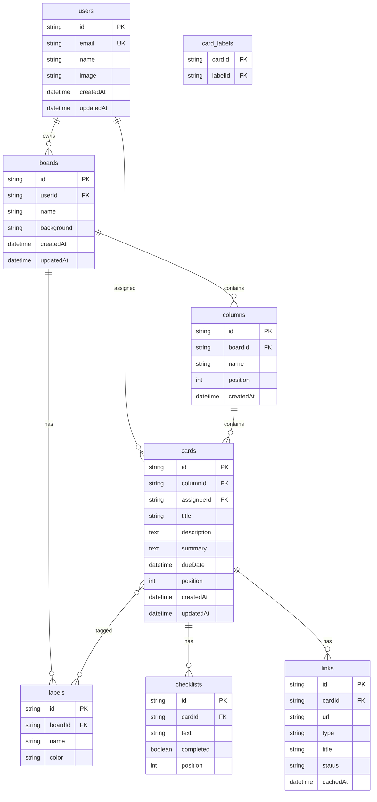

# Database Schema

TaskFlow uses **Drizzle ORM** with **SQLite** for data persistence.

## Entity Relationship Diagram



## Tables

### users

Stores authenticated user information from GitHub OAuth.

| Column | Type | Constraints | Description |
|--------|------|-------------|-------------|
| id | TEXT | PK | Unique identifier |
| email | TEXT | UNIQUE, NOT NULL | User email |
| name | TEXT | | Display name |
| image | TEXT | | Avatar URL |
| createdAt | DATETIME | DEFAULT NOW | Account creation |
| updatedAt | DATETIME | | Last update |

### boards

Kanban boards owned by users.

| Column | Type | Constraints | Description |
|--------|------|-------------|-------------|
| id | TEXT | PK | Unique identifier |
| userId | TEXT | FK → users.id | Board owner |
| name | TEXT | NOT NULL | Board name |
| background | TEXT | | Background color/image |
| createdAt | DATETIME | DEFAULT NOW | Creation timestamp |
| updatedAt | DATETIME | | Last update |

### columns

Workflow columns within a board.

| Column | Type | Constraints | Description |
|--------|------|-------------|-------------|
| id | TEXT | PK | Unique identifier |
| boardId | TEXT | FK → boards.id | Parent board |
| name | TEXT | NOT NULL | Column name |
| position | INTEGER | NOT NULL | Display order |
| createdAt | DATETIME | DEFAULT NOW | Creation timestamp |

### cards

Task cards within columns.

| Column | Type | Constraints | Description |
|--------|------|-------------|-------------|
| id | TEXT | PK | Unique identifier |
| columnId | TEXT | FK → columns.id | Parent column |
| assigneeId | TEXT | FK → users.id | Assigned user |
| title | TEXT | NOT NULL | Card title |
| description | TEXT | | Full description |
| summary | TEXT | | AI/generated summary |
| dueDate | DATETIME | | Due date |
| position | INTEGER | NOT NULL | Display order |
| createdAt | DATETIME | DEFAULT NOW | Creation timestamp |
| updatedAt | DATETIME | | Last update |

### labels

Colored labels for categorization.

| Column | Type | Constraints | Description |
|--------|------|-------------|-------------|
| id | TEXT | PK | Unique identifier |
| boardId | TEXT | FK → boards.id | Parent board |
| name | TEXT | NOT NULL | Label name |
| color | TEXT | NOT NULL | Hex color code |

### card_labels

Many-to-many relationship between cards and labels.

| Column | Type | Constraints | Description |
|--------|------|-------------|-------------|
| cardId | TEXT | FK → cards.id | Card reference |
| labelId | TEXT | FK → labels.id | Label reference |

**Primary Key**: (cardId, labelId)

### checklists

Subtasks/checklist items within cards.

| Column | Type | Constraints | Description |
|--------|------|-------------|-------------|
| id | TEXT | PK | Unique identifier |
| cardId | TEXT | FK → cards.id | Parent card |
| text | TEXT | NOT NULL | Checklist item text |
| completed | BOOLEAN | DEFAULT FALSE | Completion status |
| position | INTEGER | NOT NULL | Display order |

### links

External links (GitHub/GitLab) attached to cards.

| Column | Type | Constraints | Description |
|--------|------|-------------|-------------|
| id | TEXT | PK | Unique identifier |
| cardId | TEXT | FK → cards.id | Parent card |
| url | TEXT | NOT NULL | Link URL |
| type | TEXT | | github_issue, github_pr, etc. |
| title | TEXT | | Cached title |
| status | TEXT | | Cached status |
| cachedAt | DATETIME | | Cache timestamp |

## Indexes

```sql
-- Performance indexes
CREATE INDEX idx_cards_columnId ON cards(columnId);
CREATE INDEX idx_cards_assigneeId ON cards(assigneeId);
CREATE INDEX idx_columns_boardId ON columns(boardId);
CREATE INDEX idx_labels_boardId ON labels(boardId);
CREATE INDEX idx_checklists_cardId ON checklists(cardId);
CREATE INDEX idx_links_cardId ON links(cardId);
```

## Migrations

Using Drizzle Kit for migrations:

```bash
# Generate migration
npm run db:generate

# Apply migration
npm run db:push

# Open Drizzle Studio
npm run db:studio
```
